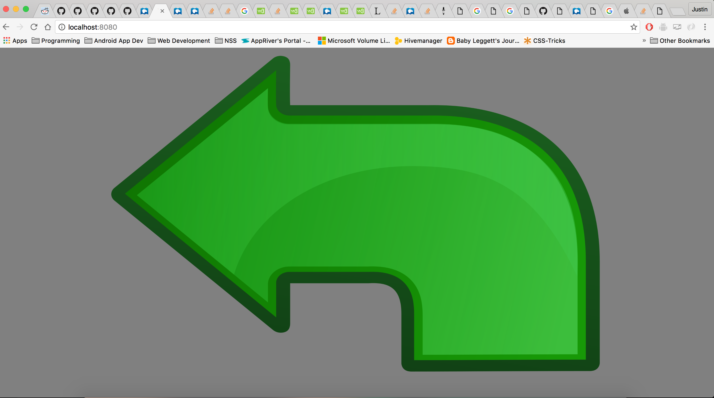
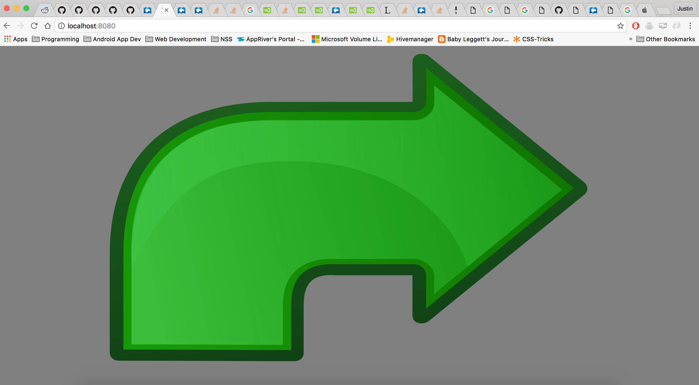

#TSA Randomizer


## Description
In this program I recreated the TSA's random arrow program. This program uses a combination of [Math.Floor](https://developer.mozilla.org/en-US/docs/Web/JavaScript/Reference/Global_Objects/Math/floor) and [Math.Random](https://developer.mozilla.org/en-US/docs/Web/JavaScript/Reference/Global_Objects/Math/random) to create a random number between 1 - 2, and this value determines which direction the arrow will point.

## How to run
In your terminal run:
```
http-server -p 9999
```
then navigate to http://localhost:9999 in your browser.

## Screenshot



## Contributors
- [Justin Leggett](https://github.com/justinal64)

